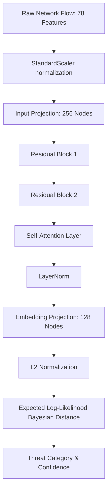

# 🛡️ MetaShield IDS v2.0: Project Overview & Architecture Guide

This document compiles the complete tech stack, AI models, cybersecurity concepts, and the implementation details of the **MetaShield IDS v2.0** network intrusion detection and prevention system.

---

## 🏆 1. Key Research Innovations

MetaShield moves beyond standard signature databases and traditional deep learning systems by leveraging **Few-Shot Class-Incremental Learning (FSCIL)** combined with Bayesian uncertainty estimation:

### A. Bayesian Few-Shot with Predictive Uncertainty (BFPU)
* **Location**: [prototypical_network.py](file:///c:/edi%20sem%204/Updated_EDI4/src/models/prototypical_network.py#L23)
* **Concept**: Rather than averaging few-shot vectors into a single point prototype (which ignores distribution density), MetaShield constructs a **Gaussian Distribution (mean $\mu$ and covariance $\Sigma$)** for each attack type. 
* **Distance Metric**: Classifies flows using an *Expected Log-Likelihood* distance metric. 
* **Benefit**: Generates a prediction confidence and an explicit epistemic **uncertainty** score. If network traffic is noisy or a threat looks highly ambiguous, the uncertainty score rises, allowing Security Operations Centers (SOC) to filter out false alerts.

### B. Bio-Inspired "Antibody" Lifecycle
* **Location**: [test_antibody_demo.py](file:///c:/edi%20sem%204/Updated_EDI4/test_antibody_demo.py)
* **Concept**: Mirroring the biological immune system, the network implements a sequential exposure protocol:
  1. **First Exposure**: An unknown attack pattern arrives and slips through the blind system.
  2. **Antibody Generation**: The analyst registers the attack using 5 examples (via `/api/learn`), which instantly generates a lightweight Bayesian prototype in RAM (the antibody).
  3. **Pathogen Detection**: Subsequent instances of the threat are identified immediately, generating an IDS alert.
  4. **IPS Neutralization**: The system activates a block rule (the antibody neutralizes the antigen). Any repeated attacks are blocked quietly at the boundary without triggering alert fatigue.

### C. Adversarial Robustness via Contrastive Learning (ARCL)
* **Location**: [prototypical_network.py (compute_loss)](file:///c:/edi%20sem%204/Updated_EDI4/src/models/prototypical_network.py#L315)
* **Concept**: Traditional machine learning models are easily fooled by small perturbations in network features (e.g. packet sizes or interval times).
* **Defense**: Integrates **Hard Negative Mining** directly into the loss calculation during training. It identifies the worst-performing 20% predictions (stealthy or perturbed flows) and multiplies their loss contribution by **3x**, forcing the model to learn highly resilient boundaries.

---

## 💻 2. The Tech Stack

MetaShield is built on a high-throughput Python machine learning and microservices framework:

* **Inference & API Layer**: **FastAPI** paired with **Uvicorn** for asynchronous execution.
* **Deep Learning Framework**: **PyTorch** (utilizing self-attention mechanisms, ResNet structures, and custom distance calculators).
* **Data Science & Sampling**: **NumPy**, **Pandas**, and **Scikit-learn** (K-Means is used for diversity sampling during active learning).
* **System Config**: **YAML** files for training parameters and **Pickle** for cached dataset scalers.
* **Visual Dashboard**: **HTML5**, **Vanilla CSS**, and **Vanilla JavaScript** (employing glassmorphic styling, real-time chart renders, and threat alert logs).

---

## 🧠 3. Artificial Intelligence & Neural Architectures



### A. Attention Embedding Network
Implemented in [AttentionEmbeddingNetwork](file:///c:/edi%20sem%204/Updated_EDI4/src/models/prototypical_network.py#L104), the model processes a 78-dimensional network flow vector through:
* **Projection Layer**: Maps features to a hidden dimension of 256.
* **Double Residual Blocks**: Two sequential [ResidualBlock](file:///c:/edi%20sem%204/Updated_EDI4/src/models/prototypical_network.py#L81) instances (incorporating Batch Normalization and Dropout) to protect against gradient degradation.
* **Feature Self-Attention**: A [SelfAttention](file:///c:/edi%20sem%204/Updated_EDI4/src/models/prototypical_network.py#L58) layer that computes internal weights dynamically to focus on key features.
* **L2 Normalization**: Projects values into a 128-dimensional unit hypersphere, stabilizing similarity distances.

### B. Prototypical Learning & Quantization
* The model computes prototypes using the [BayesianPrototypeAttention](file:///c:/edi%20sem%204/Updated_EDI4/src/models/prototypical_network.py#L23) module.
* Prototypes and inference operations are cast to Float16 (`.half()`) using **FP16 Quantization** in the [FewShotThreatDetector](file:///c:/edi%20sem%204/Updated_EDI4/detector.py#L25) to increase indexing speed. This allows it to evaluate batches of 100 flows in under **5 milliseconds**.

---

## 🔒 4. Cybersecurity Concepts Applied

1. **NIDS (Network Intrusion Detection System)**: Passive inspection of incoming connection attributes (e.g. packet lengths, durations, connection flags) mapped to classifications.
2. **IPS (Network Intrusion Prevention System)**: Active disruption of malicious sessions. Once a threat is classified, the system transitions from auditing to active filtering.
3. **Active Learning**: In security, labeling is expensive. The [ActiveLearner](file:///c:/edi%20sem%204/Updated_EDI4/active_learning.py#L5) queries human analysts *only* for flows where the model is highly uncertain, accelerating human-in-the-loop validation.
4. **Privacy Preservation**: Distributed sync allows edge systems to exchange Gaussian prototype updates ($\mu$ and $\Sigma$) instead of raw traffic details, keeping internal network activities private.

---

## 🛡️ 5. How the IPS Firewall is Created & Implemented

The simulated firewall is implemented directly inside the microservice layer in [api.py](file:///c:/edi%20sem%204/Updated_EDI4/api.py). It acts as a stateful lookup controller that acts like a dynamic packet filter.

### A. The Block Registry & Config
In [api.py](file:///c:/edi%20sem%204/Updated_EDI4/api.py#L26-L28), the API registers blocked attacks:
```python
# [IPS] Blocked attack registry — attacks added here are actively blocked
blocked_attacks: dict = {}  # attack_name -> last_seen_timestamp
BLOCK_TIMEOUT_SECONDS = 15  # Auto-unblock after 15s of inactivity
```

### B. The Cleanup Mechanism (Time-To-Live / TTL)
To prevent locking out legitimate traffic permanently (for instance, if an attack ends or is a false positive), a background cleanup routine periodically removes idle block entries:
```python
def cleanup_blocked_attacks():
    now = time.time()
    expired = [name for name, t in list(blocked_attacks.items()) if now - t > BLOCK_TIMEOUT_SECONDS]
    for name in expired:
        del blocked_attacks[name]
        logger.info(f"🔄 Auto-unblocked '{name}' after {BLOCK_TIMEOUT_SECONDS}s of inactivity")
```

### C. The Dynamic Filter & Auto-Upgrading Rules
Whenever the detection API is called (`POST /api/detect`), the incoming flow features are first classified. If an attack is detected, the firewall runs its interception logic:
```python
@app.post("/api/detect", response_model=DetectionResponse)
async def detect_threat(flow: FlowFeatures, background_tasks: BackgroundTasks):
    cleanup_blocked_attacks()
    start = time.time()
    attack, confidence = detector.detect(flow.features)
    proc_time = (time.time() - start) * 1000
    ...
    is_blocked = False
    msg = None

    if attack:
        severity = 'critical' if confidence > 0.9 else 'high' if confidence > 0.7 else 'medium'
        is_blocked = attack in blocked_attacks

        if not is_blocked:
            # Rule 1: FIRST OCCURRENCE -> Instantly upgrade to IPS Mode & block
            blocked_attacks[attack] = time.time()
            is_blocked = True
            msg = f"🚨 Threat detected: '{attack}' — SYSTEM AUTO-UPGRADED TO IPS MODE (Blocked)"
            logger.warning(f"🚨 Auto-blocking threat: '{attack}'...")
        else:
            # Rule 2: REPEAT OCCURRENCE -> Keep rule alive, return quiet block log
            blocked_attacks[attack] = time.time()
            msg = f"⚠️  Attack '{attack}' was seen before and is already BLOCKED. No impact on system."
            logger.info(f"🔒 Repeat blocked attack detected: '{attack}' — ignored.")
```

### D. Manual Firewall Control Endpoints
Administrators can interactively create or delete firewall drop rules using dedicated API endpoints:
* **Create Block Rule (`POST /api/block`)**: Manually registers an attack category in the `blocked_attacks` registry.
* **Delete Block Rule (`POST /api/unblock`)**: Removes the specified category from the registry, resetting the system to passive IDS mode.
* **Active Rules View (`GET /api/blocklist`)**: Exposes the live firewall rule registry.
